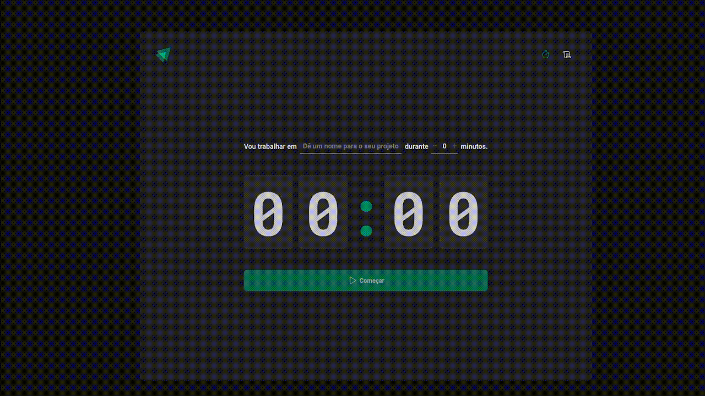

# Ignite Timer

An app for managing tasks with a timer. Users can add new tasks and start a timer for each one, pause the timer, and view task history.

## 🔨 Features

- [x] Add new task
- [x] Interrupt task
- [x] View task history

## 🧪 Tools

- [React](https://react.dev/)
- [Vite](https://vitejs.dev/)
- [TypeScript](https://www.typescriptlang.org/)
- [Styled Components](https://styled-components.com/)
- [React Hook Form](https://react-hook-form.com/)
- [React Router Dom](https://www.npmjs.com/package/react-router-dom)
- [zod](https://zod.dev/)
- [date-fns](https://date-fns.org/)
- [immer](https://immerjs.github.io/immer/)
- [phosphor-react](https://phosphoricons.com/)

## 🚀 Deploy

You can access the project through [this link](https://ignite-timer-foundations.vercel.app/)

---

Developed with 💜 by <a href="https://www.linkedin.com/in/palomarodrigs" target="_blank">Paloma Rodrigues</a>

